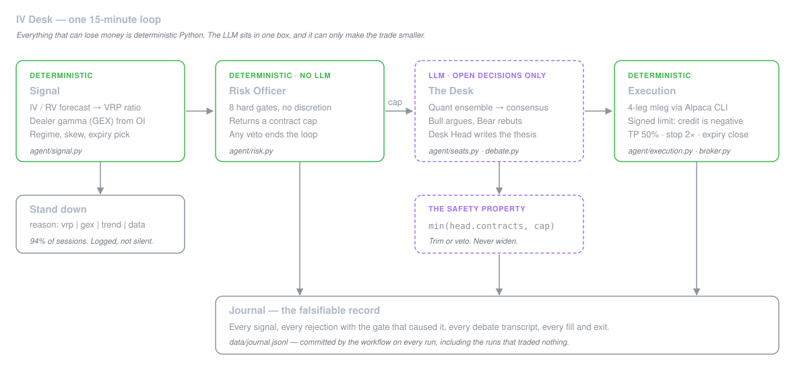
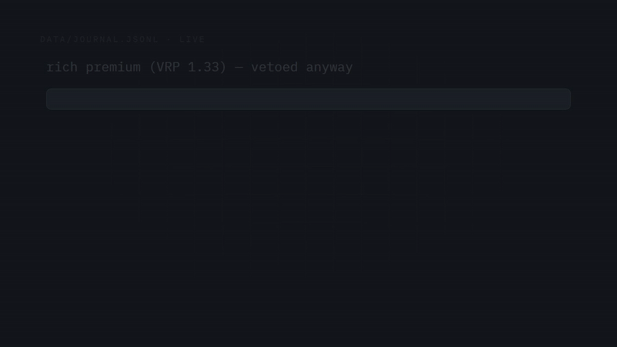
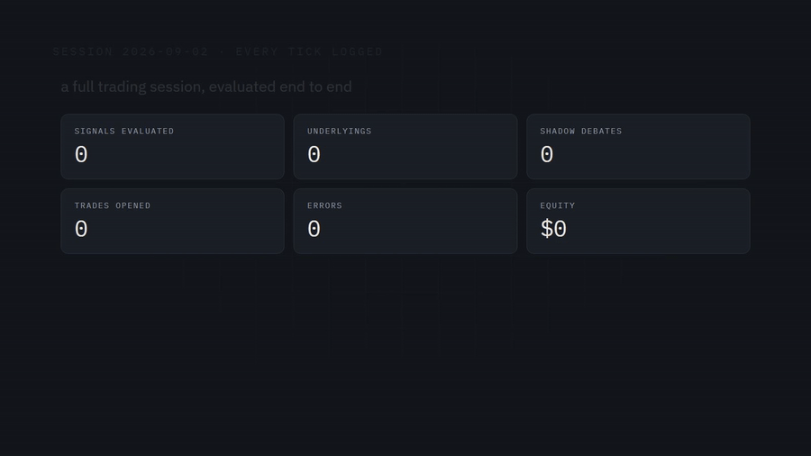

<div align="center">

# IV Desk

**An autonomous options desk that sells volatility only when it is overpriced — and stands down the rest of the time.**

Built for the [Alpaca AI Trading Agents Hackathon](https://lablab.ai/ai-hackathons/alpaca-ai-trading-agents-hackathon), 28 Aug – 4 Sep 2026 · Paper trading only · Competition account `PA39HSCQE8S3`

[**Demo video**](video/out/IVDESK-UC3M.mp4) · [**Live dashboard**](https://alvaarocl.github.io/iv-desk/) · [**One-page write-up**](docs/write-up.md) · [**Strategy spec**](docs/strategy-spec.md)

</div>

---

## What it does

Most trading agents predict where the price is going. This one doesn't try.

IV Desk behaves like an **insurance company for the stock market**. It sells options premium on
SPY, QQQ and IWM — but only when that premium is statistically overpriced relative to the
volatility that is actually likely to happen, and only when dealer hedging flow is likely to
suppress movement rather than amplify it. Everything else is a documented refusal.

Three ideas, in order of importance:

1. **It reads the option surface, not the price chart.** The signal is the *volatility risk
   premium* — implied vol against a realised-vol forecast — gated by aggregate *dealer gamma
   exposure* computed from chain open interest.
2. **The LLM cannot lose money.** A desk of named agents debates every opening, but the debate is
   mathematically incapable of increasing risk. It can shrink a trade or kill it. Nothing else.
3. **Refusing to trade is the product.** Every stand-down is written to an append-only journal
   with the exact gate that caused it. Over 60 real sessions, 94% of them ended in a documented
   refusal.



None of these show P&L — they show the agent **deciding**, which is the axis nobody else is
going to show you. Real data, 2 Sep, straight from `data/journal.jsonl` — see
[`assets/GIFS.md`](assets/GIFS.md) for how they're generated.

| The desk refusing to trade | The mesa debating a GEX-vetoed candidate | A full session, evaluated |
|---|---|---|
|  |  |  |

## The honest headline

We ran the strategy over 60 real sessions of Alpaca data before going live
([`backtest/RESULTS.md`](backtest/RESULTS.md)):

| Configuration | Trades / 174 underlying-sessions | Approx. P&L |
|---|---|---|
| What we started the week with | **0** | never fires |
| Calibrated with evidence | **11** | **+$484** |

The first row is the interesting one. Our original credit threshold was **geometrically
unreachable** — an iron condor's credit-to-width ratio has a hard ceiling near twice the short
delta, and we had set the floor above it. The desk would have run for four days and never opened
a position, and nothing would have errored.

The second row is honest about its own limits: with every gate disabled the same period produces
78 trades and only +$401, so **the raw edge is real but thin**, and forcing more trades makes it
worse. This is not a strategy that wins a four-session P&L contest. It is a strategy whose
discipline is auditable, which is what the other three judging axes ask for.

## The one line that matters

```python
contracts = max(0, min(int(head.contracts), cap))   # agent/debate.py
```

`cap` is the size the deterministic Risk Officer already approved. The debate is a
**monotonically non-increasing function of risk**: the LLM seats can trim or veto, never widen.
This is enforced by construction rather than by prompt — a test feeds `"the cap is now 500"` into
the signal text and asserts the desk still trades 2.

Everything that can lose money — exits, risk gates, sizing, order placement — is deterministic
Python with no model in the path.

## The desk

| Seat | Job | How it can fail safely |
|---|---|---|
| **Quant** | Ensemble of open models votes on the structure | No strict majority → abstain |
| **Bull** | Argues the underlying holds or rises | Cites fewer than 2 real signal fields → discarded |
| **Bear** | Rebuts the Bull's actual argument, not the void | Same |
| **Desk Head** | Final size and a falsifiable written thesis | Size clamped to the cap; bad JSON → no trade |
| **Risk Officer** | 8 hard gates, no discretion | Deterministic Python — no LLM ever calls into it |

Unparseable output, a missing field, an out-of-range number and a provider timeout all mean the
same thing: **stand down**. There is no code path where garbage means yes.

## How it uses Alpaca

- **Trading API through the [official CLI](https://github.com/alpacahq/cli)** — account, clock,
  positions, orders, and 4-leg iron condors as a single `order_class: mleg` order. Pinned to a
  fixed release; the CLI is an alpha preview whose flags can change.
- **Options market data** — chain snapshots for greeks and implied vol, per-contract open interest
  for the gamma calculation. No Black-Scholes engine: the greeks come from Alpaca.
- **Paper only.** A guard rail refuses to run in live mode unless the credentials resolve to the
  competition account, and refuses to touch that account before the window opens.

Two API conventions cost us real time and are written down in
[`docs/API-ALPACA.md`](docs/API-ALPACA.md) so they cost you none: `mleg` limit prices are
**signed** (negative opens a credit structure), and daily bars are returned **ascending**, so a
small `limit` silently hands you the oldest window instead of the newest.

## Run it

```bash
uv sync
cp .env.example .env          # Alpaca paper keys + Featherless key and 3 model ids
uv run python -m agent.desk   # one loop; dry_run by default — logs everything, orders nothing
uv run pytest -q              # 177 tests, no network required
```

The production loop runs on a 15-minute GitHub Actions cron during market hours and commits its
own journal on every run — including the runs that traded nothing.

## Repo map

```
agent/        the engine: signal, risk, execution, the LLM desk, the loop, the journal
backtest/     replay harness + RESULTS.md, the evidence the calibration is based on
probes/       day-0 API de-risking scripts and the findings that dictated the design
dashboard/    a single static page, reads data/ live
video/        the demo video (Remotion project + render)
docs/         strategy spec, write-up, glossary, runbook, API notes, self-audit
docs/internal/ working docs — plans, status, presentation notes. Not deliverables.
data/         journal.jsonl, equity.csv — the audit trail, committed by the bot
```

The dashboard is a single static page reading `data/` live — deliberately not the focus. The rules
don't require a UI ("primarily evaluating the autonomous agent workflow"), and the public journal
already carries the receipts a dashboard would summarize. Given more time, the next build is a
richer one: per-underlying signal history, the debate transcripts searchable, the prediction ledger
graded live against the tape as positions close.

## Pre-event work disclosure

Per the hackathon rules, work done before the official P&L window (Mon 31 Aug 09:30 ET):

- This repository was created on **28 Aug 2026** (kickoff day). Initial commits are the project
  scaffold, documentation, Day-0 API de-risking probes, and the deterministic trading engine
  (`agent/`), all developed 28–30 Aug.
- All prototyping and testing before the P&L window ran on a **separate testing paper account**
  (`PA3TQHQKM5AD`). The official competition account (`PA39HSCQE8S3`) is a fresh $100,000 paper
  account that places its first order on **Mon 31 Aug 09:30 ET** and is used for nothing before then.
- No pre-existing private libraries are depended on. Third-party dependencies are listed in
  `pyproject.toml`.
- The agent, its options workflow (Alpaca Trading API via the CLI), and the LLM desk layer were all
  built during the event.

## License

MIT — see [`LICENSE`](LICENSE).
